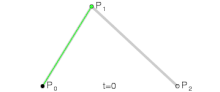
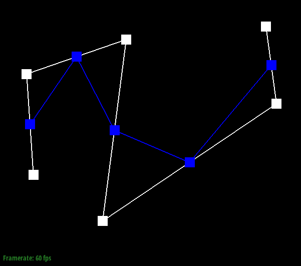
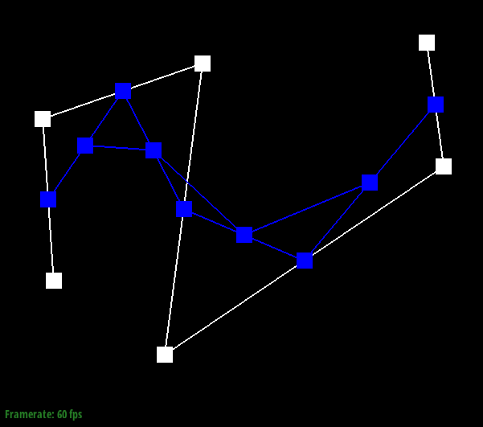
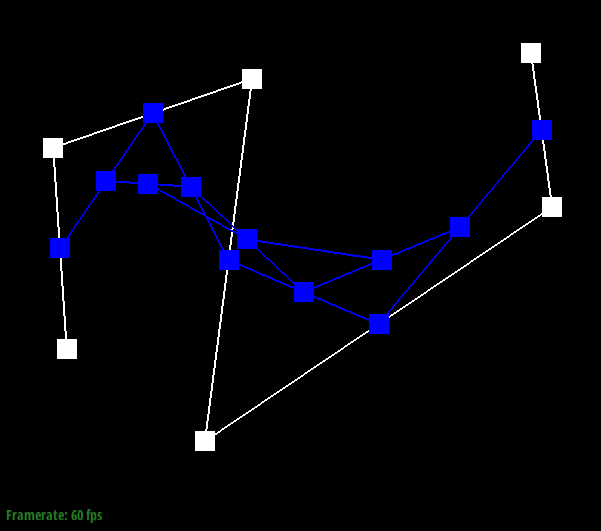
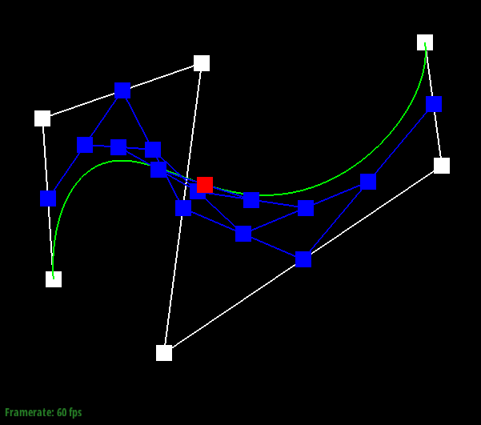
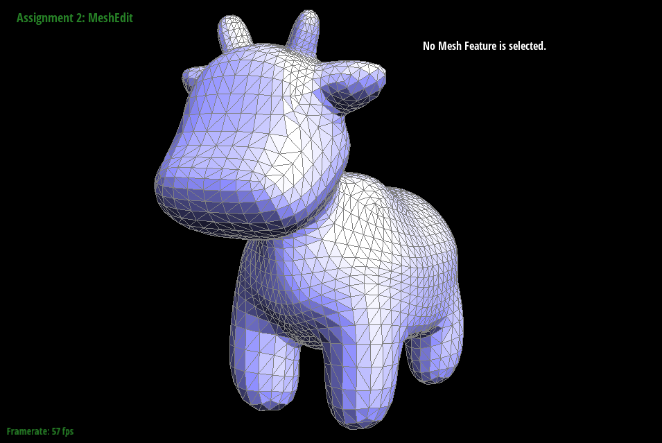
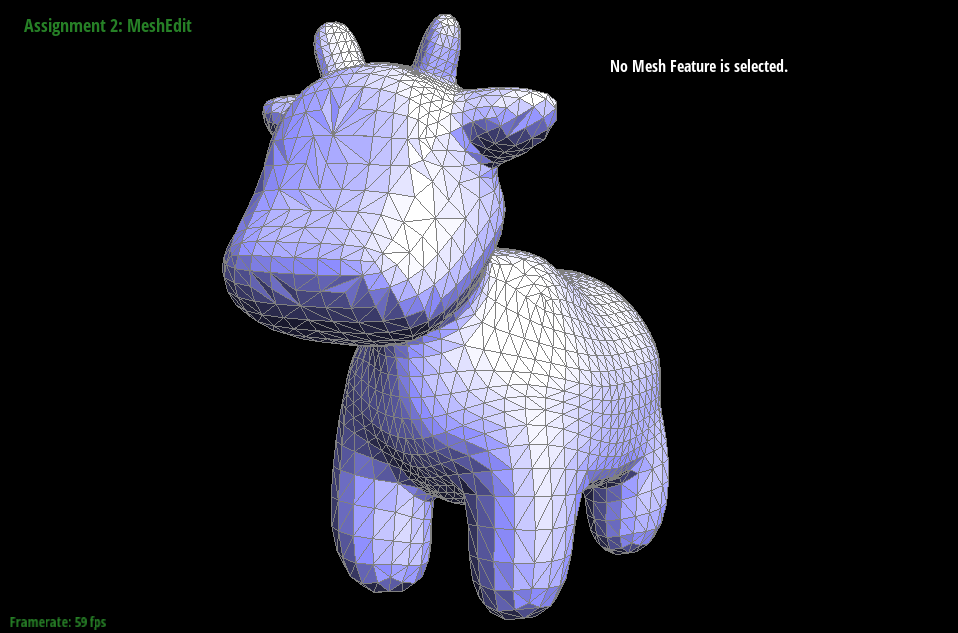

# <center> **CS 184: Computer Graphics and Imaging, Spring 2021** <!-- omit in toc -->

## <center> **Project 12 Rasterizer** <!-- omit in toc -->

## <center> **Frank Warren** </center> <!-- omit in toc -->

## **Contents** <!-- omit in toc -->

- [**Overview**](#overview)
- [**Section I: Bezier Curves and Surfaces**](#section-i-bezier-curves-and-surfaces)
  - [**Part 1: de Casteljau's Algorithm**](#part-1-de-casteljaus-algorithm)
  - [**Part 2: Bezier Surfaces with Separable 1D de Casteljau**](#part-2-bezier-surfaces-with-separable-1d-de-casteljau)
- [**Section II: Triangle Meshes and Half-Edge Data**](#section-ii-triangle-meshes-and-half-edge-data)
  - [**Part 3: Area-Weighted Vertex Normals**](#part-3-area-weighted-vertex-normals)
  - [**Part 4: Edge Flip**](#part-4-edge-flip)
  - [**Part 5: Edge Split**](#part-5-edge-split)
  - [**Part 6: Loop Subdivision for Mesh Upsampling**](#part-6-loop-subdivision-for-mesh-upsampling)

## **Overview**

The purpose of this project was to implement explore topics on geometric modeing, including Bezier curves and surfaces, the de Casteljau algorithm for calculating those, manipulating triangle meshes, and loop subdivision. The first section of this project deals with Bezier curves and surfaces, and the second section deals with triangle meshes and the half-edge data structure.  
I completed this project alone.

## **Section I: Bezier Curves and Surfaces**

[Bezier curves](https://en.wikipedia.org/wiki/B%C3%A9zier_curve) are the most popular way to create curves from a set of points. A Bezier Curve can be defined with two or more control points. $(n+1)$ points are needed to define a Bezier curve of degree $n$. There's multiple ways to define a Bezier curve given a set of points. One could use linear algebra to define a degree $n$ polynomial given $(n+1)$ points, and plot the polynomial to include the start and end points. There is a more practical method called [de Casteljau's algorithm](https://en.wikipedia.org/wiki/De_Casteljau%27s_algorithm).

### **Part 1: de Casteljau's Algorithm**  

[de Casteljau's algorithm](https://en.wikipedia.org/wiki/De_Casteljau%27s_algorithm) is a recursive algorithm for evaluating Bezier curves. Basically, it takes a set of points along with a parameter $t$ and performs linear interpolations on each pair of neighboring points. Then this same calculation is performed recursively on these intermediate points using the same parameter $t$ until no more pairs of intermediate points can be found. At the end of this algorithm, we are left with a single point that will be on the final Bezier curve.  

If we perform this algorithm for a large number of $t$ values, we will be able to create a smooth curve.  
Here is an animation that illustrates the relationship between $t$, the control points, and the final curve:  
<center></center>  

Here's an example of what the recursive de Casteljau algorithm looks like at each step for some set of 6 control points and some $t$. In the last subdivision, the final point is shown in red. In the final image, I show the final result for a different $t$ value.  

| |  |  |
|:--:|:--:|:--:|
| Before | First subdivision | second subdivision |

| |  |  |
|:--:|:--:|:--:|
| Third subdivision | Fourth subdivision | Fifth (final) subdivision |

|  |
|:--:|
| Different $t$ value |

### **Part 2: Bezier Surfaces with Separable 1D de Casteljau**

In this part, the de Casteljau algorithm will be extended to create curved surfaces in three dimensions. The implementation for this is pretty much the same as for Bezier curves, except now we have 4 rows of 4 points.Each row of four points represents a Bezier curve that is parameterized by some value $u$, and after the four Bezier curves are created, then we can create another Bezier curve along the other axis by using the four points at $u$ on the four Bezier curves, and parameterizing them on $v$.  

Here's the [Utah teapot](https://en.wikipedia.org/wiki/Utah_teapot) rendered using Bezier surfaces:  
<center></center>

## **Section II: Triangle Meshes and Half-Edge Data**

In this section, we will use triangle meshes to model 3D objects. Although Bezier surfaces are better at representing curves smoothly and require less memory than triangle meshes, triangle meshes are used more frequently because Bezier surfaces because it's difficult to calculate their intersections with other surfaces.  

A convenient data structure for triangle meshes is the Half-Edge data structure. The main idea for this data structure is that each face in the mesh is composed of half edges such that the ordering of the each face is consistent. To enable convnient iteration of vertices, edges, and faces, each half-edge has useful members. Also, there are Vertex, Edge, and Face objects which have their own useful functions.

```C++
struct Halfedge {
  Halfedge *twin;   // the Halfedge opposite to this Halfedge
  Halfedge *next;   // the next Halfedge on the same face as this Halfedge
  Vertex *vertex;   // the tail of this Halfedge
  Edge *edge;       // the undirected edge on the mesh
  Face *face;       // the face to which this Halfedge belongs
}
```

### **Part 3: Area-Weighted Vertex Normals**

A simple method for shading known as [flat shading](https://en.wikipedia.org/wiki/Shading#Flat_shading) is already implemented at this point in the project. In this shading technique, lighting is evaluated once per face, where the intensity of the light to be displayed on a face is determined based on the normal to that face. (i.e. how far away the face is from the light, and the orientation of the face in relation to the light). Because the light on each face is only evaluated once per face, the result is not very smooth.  

To achieve better shading, we can interpolate the surface normals of the faces. This is done by calculating, for each vertex, a normalized vector derived from the weighted sum of the surface normals of each face it belongs to. A do-while loop can be used to iterate through the faces associated with some vertex `v`:  

```C++
Halfedge CIter h = v->halfedge();
do {
  // Process h->face() in this loop
  h = h->twin()->next();
} while (h != v->halfedge());
```

Here's what the Utah teapot looks with flat shading, and with Phong shading:

|  |  |
|:--:|:--:|
| Flat Shading | Phong Shading |


### **Part 4: Edge Flip**

One of the basic operations that a half-edge data structure needs to provide is edge flips. Given a pair of triangles, a flip operation performed on their shared edge will convert the original pair of triangles into a new pair that share an edge formed by the vertices that were *not* in the original shared edge:  

<center></center>  

Implementing this means operation changing the pointers for each half edge object relating to the two triangles. The process itself isn't too bad, especially because the process is fully spelled out [here](http://15462.courses.cs.cmu.edu/fall2015content/misc/HalfedgeEdgeOpImplementationGuide.pdf). The process is further simplified since halfedge objects have a member function that can set all of its pointers at once:

```C++ 
void setNeighbors(HalfedgeIter next, HalfedgeIter twin, VertexIter vertex, EdgeIter edge, FaceIter face)
```

Here's a mesh of a cute cow before and after some edge flips:

|  |  |
|:--:|:--:|
| Before flips | After flips |

### **Part 5: Edge Split**

Another basic operation for half-edge data structures is edge splits. Given a pair of triangles, a split operation on their shared edge creates a new vertex in the center of the edge and then edges are formed between the new vertex and every other vertex in the two triangles:  

<center></center>  

The implementation for this is similar to the implementation for edge flips. Basically, I drew two diagrams of set of triangles with a shared edge, before and after a split operation on the shared edge. The diagrams had all of the vertices, faces, edges, and half edges labelled. Writing the split function was just a matter of carefully representing the "after" diagram in terms of the half-edge object and pointers.  

Here's a cube before and after some flip and split operations:

|  |  |
|:--:|:--:|
| Before | After |

### **Part 6: Loop Subdivision for Mesh Upsampling**